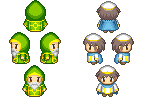

# 2D-Tile-game

The project I built is a 2D Tile Map Game (will be explained in detail later). The game takes us to an adventure as a hero who is saving villages and fighting monsters with great effort while being led with good interactive dialogues and signs all around different maps. 

Games are one of the most popular entertainment worldwide. It provided thousands of new job opportunities as it helped all kinds of people to achieve great things in a way or another. Which explains the growth of its industry; Since, it even surpassed music and film industry put together. With “Minecraft”, until now, being the most sold game counting 180 million sales.

## Technology used 

I developed my project using `Java` and `Eclipse` as an IDE. I created smooth / play friendly mechanics and designed, by using non copyrighted resources, the best-looking game imaginable.

## How to run

To get started you can `git clone  https://github.com/DYasser/2D-Tile-game.git` and have `Java` installed and initialized. You can run the file then by runing the main class using an IDE.


# Overview

The player spawns as a hero in a village that is forsaken without any habitants, but thanks to the notes left behind by the villagers, the player finds out what is happening and discovers that monsters attacked the town and that he needs to save them.

## Entities

All Entities are extended from a class named `Entity` that gives them properties such as speed, width, gold amount, and other important properties for it to be considered as an entity.

- First we have **`the hero (the player)`**: He can dash in any direction he points to after waiting enough time to fully charge the ability bar displayed below him in game, he can also attack any monster near him, in addition to interact with his environment.
	By using all kinds of keys that I will go through in more details after, only reflexes will be able to help the player to get through the different stages. 

<p align="center">
  
</p>

- Next we have **`the villagers`**: NPCs that have distinctive messages and dialogues that gets displayed when the hero
interacts with them.
	 Have a circular range that activates the possibility to display the dialogues (stored as an array of strings) if the player collides with it.

<p align="center">
  
</p>

- I also added **`healers`**: Heals the hero entirely in exchange of 50 golds, that are easily collected by killing monsters or opening chests.
	 Same as Villagers, they have a circular range that activates the possibility to display the message and be able to choose whether to get healed or not.

<p align="center">
  
</p>

- There are also **`traitors`**: Villains that are disguised as villagers, they show their true nature after being talked to 
and choosing a wrong answer.
	 When the player gets in their range, and interacts, he gets two choices: One, that lets the player continue playing as normal. Two, the Traitor in form of a villager spawns a skeleton and starts attacking the player.

- **`Skeletons`**: Slow enemy that have the least damage among all the villains. 
	Follows the Player depending on its coordinates, will be explained in more details in a future section.

<p align="center">
  
</p>

- **`Phantoms`**: The fastest among all the villains, and one of the strongest. They have a 4 sec cooldown
where they lock in the player then attacks him. They should be attacked when they are not moving and vulnerable.
He owns a big range that almost covers all the window. Once the player enters that range the enemy locks in the player and an indicator below it shows through colors (green, yellow, and red) when he will be going to attack.

<p align="center">
  
</p>

- **`Mage`**: Monster with a high range that attacks by sending magic orbs towards the player after
locking them for 3 seconds.
	 They also have a big range, almost as big as the phantoms. Once the player steps in, the entity starts charging its attack and launches it after going through the signal (green, yellow, and red) that is visible below it.

<p align="center">
  
</p>

- **`Chests`**: Entity that is opened to acquire gold, which is, again, the money of this game.
Player needs to get close to the range, then he will have an indicator that will help him
understand what to do to get the gold. Graphics comprised inside map tiles.

- **`Doors and portals`**: They allow the player to enter new maps.
	Within a special range, the player has the right to activate it. Then, a Boolean that is responsible of map changing gets changed and decides of what map should be displayed. 

All graphics used thanks to [Pipoya](https://pipoya.net/sozai/) 

## Maps and map collisions

<p float="left">
  
   
  
  
</p>

The prototype built features 4 maps: the main map, which is the village where the player starts his journey, a first house that is supposed to be the chief’s, a second house, and a dungeon where monsters are found and must be slayed.

All my maps are formed with 16x16 pixel tiles and form a 50x50 blocks width and height.

Using the software `Tiled` and different tilemaps (16x16 images representing all kind of blocks put in a PNG file) I was able to create maps and export them into `XML files`, that will be easier for the code to understand and read them. By first, creating different layers that had different roles: block layer that would be in charge of collisions, which means either blocking the player and not letting him go through a wall, for example, or making him fall and lose all of his health by walking into a hole.


```Java
imagePath = eElement.getAttribute("name");
tileWidth = Integer.parseInt(eElement.getAttribute("tilewidth"));
tileHeight = Integer.parseInt(eElement.getAttribute("tileheight")); 
tileCount = Integer.parseInt(eElement.getAttribute("tilecount"));
tileColumns = Integer.parseInt(eElement.getAttribute("columns"));
sprite = new Sprite("tiles/" + imagePath + ".png", tileWidth, tileHeight);

list = doc.getElementsByTagName("layer"); 
layers = list.getLength();

for(int i = 0; i < layers; i++)
{
 node = list.item(i);
 eElement = (Element) node;
 if(i <= 0)
 {
   width = Integer.parseInt(eElement.getAttribute("width")); 
   height = Integer.parseInt(eElement.getAttribute("height"));
 }

 data[i] = eElement.getElementsByTagName("data").item(0).getTextContent();

 if(i >= 1)
 {
   tm.add(new TileMapNorm(data[i], sprite, width, height, blockWidth, blockHeight,tileColumns));
 }
 else 
 {
   tm.add(new TileMapObj(data[i], sprite, width, height, blockWidth, blockHeight,tileColumns));
 }
```

We can see how the program gets all the elements necessary from the XML file such as tile width, tile height, the number of columns and row, and so on. Then, the first layer (the solid layer) gets checked by its own followed by the other layers that are supposed to be decorating the maps without any special effect on the entities.
Each block has an ID designed to it and can be recognized by that same ID. By converting any map created in the software “Tiled” into an XML file, I was able to make my code read any map and display it without any problem.

Each map has different layers that are given IDs to each. So, the code goes through each block row by row, column by column, layer by layer, checks each block and assigns to it the collision type depending on its ID, it then displays it.


```Java
String[] block = data.split(",");			//split data
for(int i = 0;  i < (width*height); i++)
{
  int temp = Integer.parseInt(block[i].replaceAll("\\s+", ""));		//get IDs
  if(temp != 0)
  {
    if(temp == 223)		//ID = 223 hole
    {
      tempBlock = new HoleBlock(sprite.getSprite((int)((temp-1) % tileColumns),(int)((temp-1) / tileColumns)),new VectorXY((int) ((i%width) * tileWidth), (int)((i/height) *tileHeight)), tileWidth, tileHeight);
    }
    else{		//else block object
      tempBlock = new ObjBlock(sprite.getSprite((int)((temp-1) % tileColumns),(int)((temp-1) / tileColumns)),new VectorXY((int) ((i%width) * tileWidth), (int)((i/height) *tileHeight)), tileWidth, tileHeight);
    }

    eventBlocks[i] = tempBlock;	
  } 

} 
```

## Mechanics

The player can move around using the keys `W` to move upwards, `A` to move leftwards, `S` to move downwards, and `D` to move rightwards. `Space` key to attack monsters. `Escape` key to pause the game, you will also be able to find all the controls there. `Ctrl` key to dash and escape from a difficult situation, or in the contrary dash through the enemies’ forces and annihilate them. `E` to interact with the environment.

Each entity has an acceleration and max speed to it to create a smooth effect where they don’t stop suddenly and makes it more enjoyable for players to play around with. 

I increment the value of x to move the player and the camera left and right (decrease the value to go left; increase it to do the contrary) or again add to the value of y to move them (decrease the value to go up; increase it for the opposite)

The *dy*, that is the value added to the Y-coordinate of the player, has its value decremented to go up. It stops at the limit that is *maxSpeed*. 

In the else clause following, we see that if the user stops pressing on the key to go up, the value stops decrementing and starts to go back to its original value: **0**.

The dash changes the properties acceleration and max speed for a small amount of time which creates the illusion that the player is dashing through when he only gets a boost changing his properties for a limited time.

# Game Design

Tilemap is an extremely known method for being used in 2D game development, it consists of building a game world or a map out of small pieces (images of 16x16, 32x32 pixels, or any other sizes), called tiles taken from a large image that regroups all of them which is where the IDs gets decided depending on their place. It is used to rise the performance and gain on memory usage. Moreover, tilemaps can be used in the game logic, such as collision handling (as we saw with blocks) or to create a level editor.

Popular games that used this incredible technique are Super Mario Bros, Pacman, Zelda, and many others.

## Camera

The Camera is one of the most important components of my game since nothing will be displayed correctly to the player without it and the game won’t work properly. 

The player gets to play in a huge map where he should be able to wander freely around thanks to the camera. It is an easy arrangement to create a huge map using tiles, but it is a much harder task to set a camera following the player. 

I chose to give the camera a width and height that will be the ones in charge of how much the player will be able to see and set them to the window’s one, I might change it in different contexts like in a dark cave for example where the player should have a smaller reach of view. The player is considered as the center of the camera, each time the player moves around using the keys the camera also moves to the same direction with its own max speed and deceleration. Additionally, I added a nice feature that allows the camera to not stop abruptly but instead to have a nice slowing motion, which allows the user to feel much more easy playing around, moreover, when the player gets close to the limits of the map, the map doesn’t go out and stays at the boundaries which helps the player understand that it is one limit of the stage.

Using collisions that I will explain in the next sub-section, I was able to make it that only what is shown inside the camera will be updated and displayed, which boosts considerably the performance of the game and makes it so that the map size or the amount of entities in a map doesn’t change the performance of the game which is a big achievement.

## Collisions

I created a class that will be linked to every entity (called Entity.java) created to help the game locating the bounds of each entity. By giving this knowledge to the program, everything became easier. I only had to add methods that will detect if one bound got inside another one by checking x and y coordinates and was able to deduce from those methods if either a collision occurred or not.	

```Java
//collisions 4 edges
public boolean collides(AABB bBox) {
  float ax = ((pos.getWorldVar().x  + (xOffset)) + (this.w/2));
  float ay = ((pos.getWorldVar().y  + (yOffset)) + (this.h/2));
  float bx = ((bBox.getPos().getWorldVar().x  + (bBox.xOffset)) + (bBox.getWidth()/2));
  float by = ((bBox.getPos().getWorldVar().y  + (bBox.yOffset)) + (bBox.getHeight()/2));

  if(Math.abs(ax - bx) < (this.w / 2) + (bBox.getWidth()/2))
  {
    if(Math.abs(ay - by) < (this.h / 2) + (bBox.getHeight() / 2))
    {
      return true;
    }
  } 

  return false;
}
```
We can see two objects A and B with each (x,y) coordinates. we see exactly how I coded the box collision, by comparing the coordinates according to the width and height of the entities evaluated.

Using these methods, I was able to create the effect of mobs hitting the player and vice-versa. I was also able to detect collision between some entities and blocks that allows the map to become more alive and create an environment of reality as I explained before. for example, the player walks into a wall, gets blocked and can’t pass through the wall, which is a logic everyone understands and that should be respected by the game. Same as when the player moves into a hole in the ground, he should fall and the ‘Game Over’ screen should be displayed after showing the hero falling. 

>     Note: the ranges for mages and other mobs are circular, so there is another method used for only circular bounds. 

## Game States

```Java
public static enum States{	//out of game states
  PLAYSTATE,
  GAMEOVER,
  MAINMENU,
  DIFFICULTY,
  OPTION
}

public static States state = States.MAINMENU;
```

To switch from the menu state to start playing the game I needed to create different screens and update each one of them. To achieve that and use it in the most efficient way possible I needed to display (render) and update a screen only when he needed to be shown. So, I stored all states in an Enum variable and was able to switch back and forth each time the user switches screens while playing through the game. I used a switch statement that will update and render only one screen at a time which makes the game much smoother.

## Animation

A must for every game is to be as much dynamic as possible. Animations helps the player to immerse himself in the game and be able to enjoy himself even better. Animations are a succession of images that are being showed and looped. To show that to the user, I created a class specifically for that. It goes though the entity’s image that is constituted with images (32x32, 48x48, or any others) and each row translates to a movement. So, the class basically is full of Booleans that show whether an action was taken by the entity (pressed the W key, for example), in that case the animation should be shown. I also added a delay to be able to change the pace of the animation from one action to another.

## Sound effects and music

I used a sound effect maker called “Bfxr” that is free to use and doesn’t have any issues with copyrighting to create the effects of buttons ticks, player attacks etc. Using the WAV files I created I applied them as clips from the imported library “javax.sound.sampled”. Same for the main theme that is also non copyrighted.

## AI and some interesting mobs

In the process of building my game, I had to build a working AI so NPCs and MOBs could think by themself at any point of the game. Building intelligent MOBs was, thanks to the classes created before, simple to implement so I decided to describe some of the most interesting ones below:

- Skeletons: Follows every move done by the player by comparing their coordinates, if the player is in his range (circular range) he would get the direction to take by getting the difference of their coordinates and follow the hero. It is one of the hardest MOBs to escape from, but the player should use his ability to lead him into a hole and get rid of him. 

- Phantom: Dashes to the players location each 4 seconds, which is calculated by using “System.currentTimeMillis()” and resets each time he attacks the enemy by dashing towards him - he directs himself by taking the difference of x and y coordinates and adding or removing the same amount so the dash looks as proper as possible. It is a fearful opponent, but the player should again use that ability to his advantage, by for example running away when it is about to dash and attack it when it is locking in the player.


# Execution:
The program starts with this moving menu screen where there are 3 options, Play, options and exit.


When you click on *Option* you get this screen where you can adjust the brightness and the volume from the game.


And finally here are some visuals of the game:


There are many NPCs in the game that will help the player and direct him towards his goal *save the village*. 
The player has two abilities, **dash** and **attack**. With these two abilities he needs to fight all sorts of monsters and complete his quest.

>     This is the end of my documentation.
